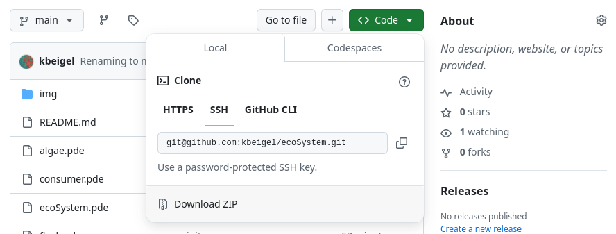
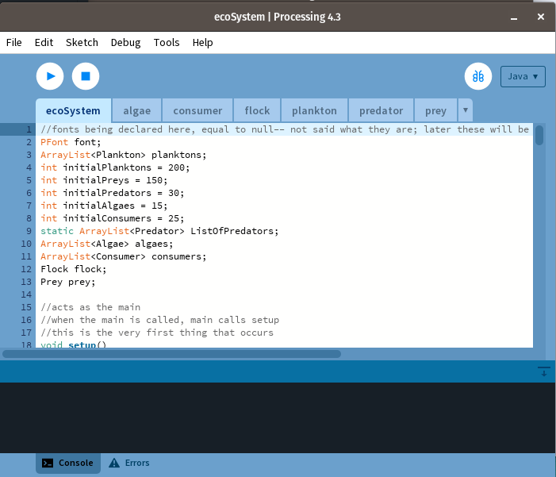
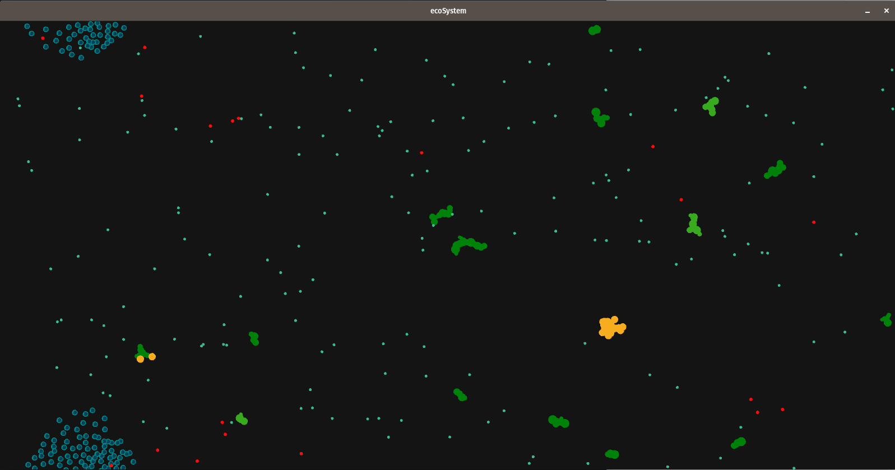

# ecoSystem

## Instructions for running
### Step 1: Download and install the Processing software.
1. Follow the download and installation instructions for [Processing](https://processing.org/download).
2. Once Processing is installed, proceed to Step 2.

### Step 2: Download the ecoSystem code from this repository.
1. **Download all the code as a zip file.** This can be done by clicking the green button that says "<> Code ▾" (scroll up to the top of the page and you'll see it), and then clicking "Download ZIP". The ZIP will be called `ecoSystem-main.zip`.

2. Once the ZIP file is downloaded, **unzip the folder** `ecoSystem-main.zip`.

3. Next, **open the Processing application** on your computer. 

4. In the Processing application, go to **File > Open, and navigate to wherever the unzipped `ecoSystem-main` folder is located**.

5. In the unzipped `ecoSystem-main` folder, **navigate into the folder `ecoSystem` and open the file `ecoSystem.pde`**. (`ecoSystem-main/ecoSystem/ecoSystem.pde`).

6. You should see the `ecoSystem.pde` file open in Processing. There should also be tabs that have opened for all of the other necessary files.

7. In Processing, there is a **play button (▶)** which will execute the code. All that needs to be done to run the code is to **press play**! You should see something like this (but with lots of movement):

8. To stop the ecoSystem from running, you should be able to just close the window. If something freezes or the normal exit window button does not work, the Processing window (where the code is shown) should have a "stop" button that can kill the app. If that doesn't work, force quit the Processing app

## How to play
The following keys can be used to interact with the ecoSystem:

Each key will provide a different input to the system. Play around and see what happens! :)